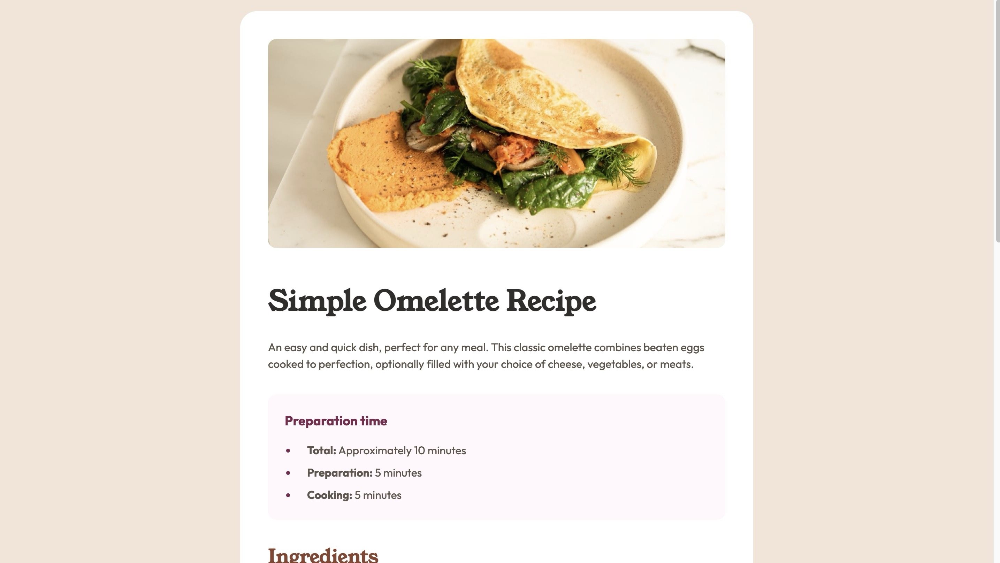
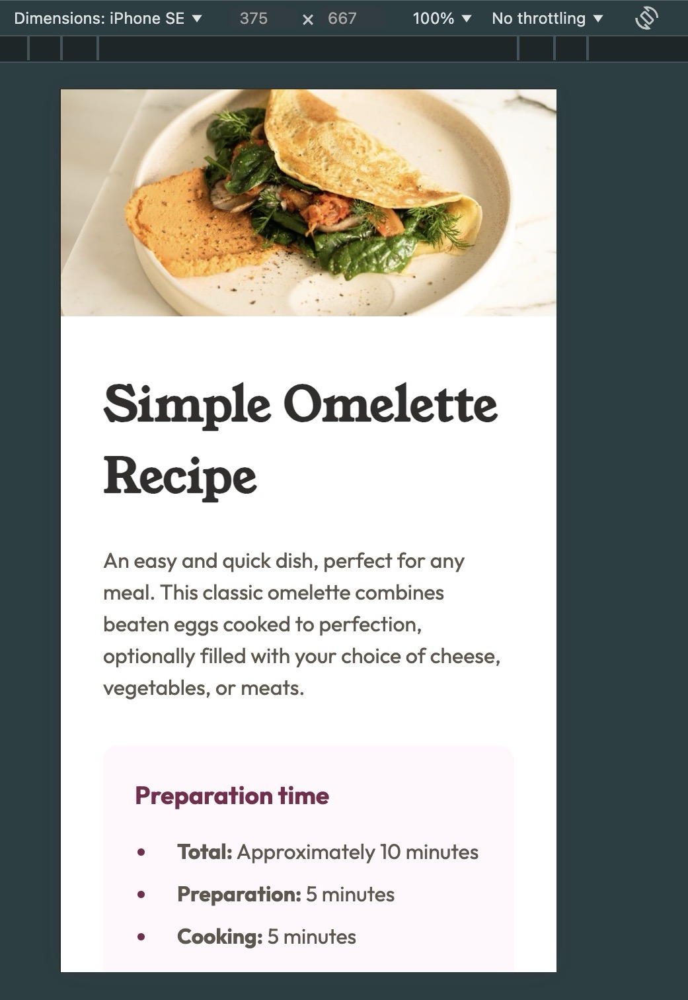
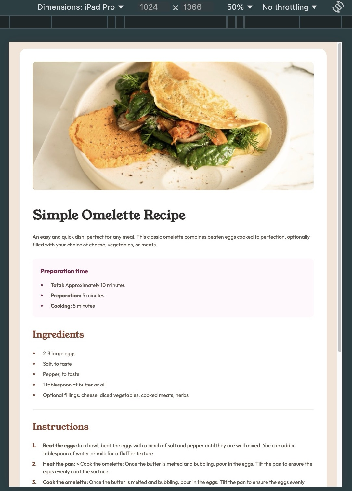

# Frontend Mentor - Recipe page Profile

[Recipe page Solution](https://www.frontendmentor.io/challenges/recipe-page-KiTsR8QQKm)

## Overview

### Links

- [Solution](https://github.com/Lokesh8055/recipe-page)
- [LiveSite](https://lp-recipe-page.netlify.app)

### Screenshot





## My process

### Built with

- Semantic HTML5 markup
- CSS custom properties
- FlexBox

### What I learned

Learned about hiding and showing the image based on screen size

```css
.omelette__desktop {
  display: none;
}

.omelette__mobile {
  display: block;
}
```

### Continued development

Will continue my focus on responsive web design principles in next projects

## Author

Frontend Mentor - [@Lokesh8055](https://www.frontendmentor.io/profile/Lokesh8055)
